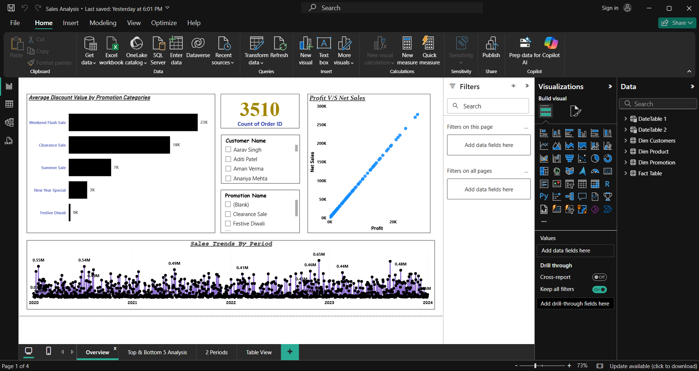

# ElectroHub-Sales-Analysis
An interactive Power BI project with a star schema data model. Includes sales trends, profit vs sales, discount analysis, top/bottom products, period comparisons, and detailed order-level insights.

# 📊 Sales Dashboard Analysis -- Power BI

This repository contains a fully interactive Power BI dashboard that provides in-depth insights into sales performance. It is designed to support data-driven business decisions with clean visuals, dynamic filters, and an intuitive reporting layout.

# 🎯 Objective

A Power BI dashboard project analyzing sales data — includes insights on sales trends, profitability, discount analysis, top/bottom products, and comparative performance across different periods.

## 📊 Dashboard Highlights

Data Model: Built using 3 Dimension Tables (Customer, Product, Promotion) and 1 Fact Table.

Data Cleaning & Transformation: Removed inconsistencies, created new calculated columns, and established relationships using Primary Keys, Foreign Keys, Cardinality, and Star Schema concepts.

Top/Bottom Analysis: Identified Top 5 & Bottom 5 Products based on Sales, Profit, and Quantity Sold.

Sales Trends: Showed how sales vary over time, including spikes and seasonal patterns.

Profit vs Sales Relationship: Analyzed correlation between revenue and profitability.

Discount Insights: Average discount offered across different promotion categories.

KPI Tracking:

Total Net Sales

Total Profit

Total Quantity Sold

Total Number of Orders

Comparative Analysis: Sales, profit, and quantity sold between two user-selected periods.

Order-level Insights: Detailed table showing sales, profit, discount, and units sold for each order, with slicers for flexible filtering.

# 📂 Power BI Project File

(Add your PBIX file link here if uploaded to GitHub or Drive)

# 📑 Dataset Used

(Add dataset file link here if you want to share raw data)

# ❓ Questions & Answers

### Q. What are the top-performing products?

Apple iPhone 14, MacBook Air, and Sony Bravia TV are among the best sellers by both sales and profit.

### Q. Which products are underperforming?

Items like Tupperware Lunch Box, Nivea Body Lotion, and Colgate Toothpaste appear in the bottom categories.

### Q. How do sales and profit relate?

A strong positive correlation — higher sales usually translate to higher profits, though discounts affect margins.

### Q. What is the average discount pattern?

Weekend Flash Sales and Clearance Sales offer the highest average discounts compared to other promotions.

### Q. Can we compare two different sales periods?

Yes ✅ -- the dashboard allows side-by-side comparison of Net Sales, Profit, and Quantity for any two custom date ranges.

# ⚙️ Project Workflow / Process

### Data Collection: 

Imported sales dataset into Power BI.

### Data Cleaning & Transformation:

Removed null values & duplicates

Standardized columns

Created new calculated columns (Profit, Discount Value, Net Sales, etc.)

### Data Modeling:

Connected tables using Primary Key, Foreign Key

Built a Star Schema with 3 dimension tables and 1 fact table

### Dashboard Design:

Used bar charts, line charts, KPIs, and tables for better visualization

Implemented slicers for dynamic filtering (Date, Customer, Product, Promotion)

### Interactive Features:

Drill-through filters

Period comparison visuals

Top/Bottom product insights
